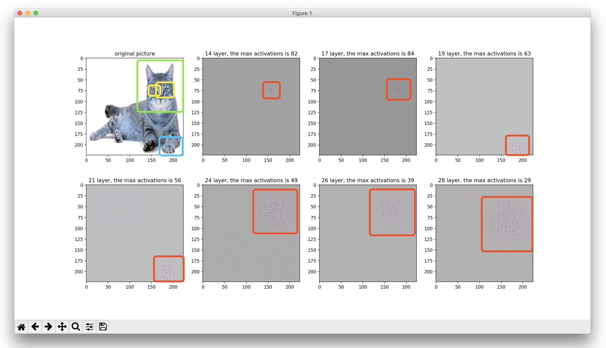

# VisualizingCNN

A PyTorch implementation of the 2014 ECCV paper "Visualizing and understanding convolutional networks"



```bash
Predicted: [('n02123045', 'tabby', 0.5042504668235779), ('n02124075', 'Egyptian_cat', 0.26163962483406067), ('n02123159', 'tiger_cat', 0.23190157115459442)]
```

## Usage

```bash
python main.py
```

## Requirement

```bash
Pytorch == 0.4.0
opencv-python == 3.4.0.12
```


## Detail

In original paper, author shows the top 9 activations in a random subset of eature maps across the validation data, projected down to pixel space using there deconvolutional network approach. But in this project, we only show the max activations (top 1) for each layer projected down to pixel space by the single image.

## Notes

The network use vgg16 pretrained from torchvision.models, the reconstruction proposal is human's labeling, rather model generate.